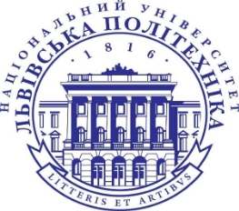
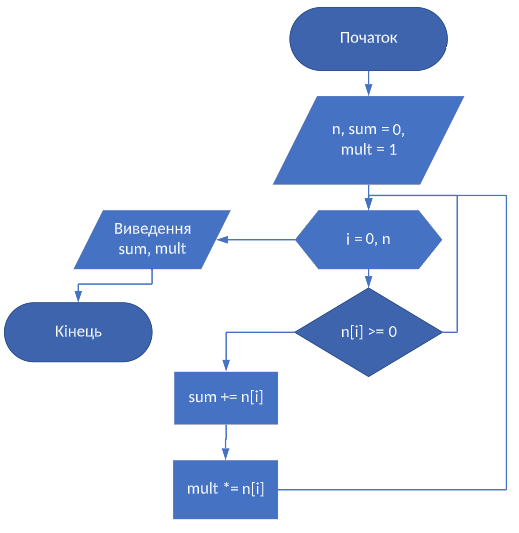

МІНІСТЕРСТВО ОСВІТИ І НАУКИ УКРАЇНИ 

НАЦІОНАЛЬНИЙ УНІВЕРСИТЕТ "ЛЬВІВСЬКА ПОЛІТЕХНІКА"

Звіт

з лабораторної роботи № 1

З дисципліни «Програмування , частина 2»

Виконав:

Ст. гр. ТР-12 

Чернега М.М.

Прийняв:

Доц. Каф. ТК

Пиріг Ю.В.

Львів – 2022

**«Основи алгоритмізації»** 

**Мета роботи:** ознайомитися із загальними принципами розробки алгоритмів, навчитися виконувати задачі щодо побудови різних типів алгоритмів.

**Завдання 2** 

**Завдання 3**

**Завдання 4**

**Висновок:** на цій лабораторній роботі я ознайомився із загальними принципами розробки алгоритмів, навчитися виконувати задачі щодо побудови різних типів алгоритмів.

